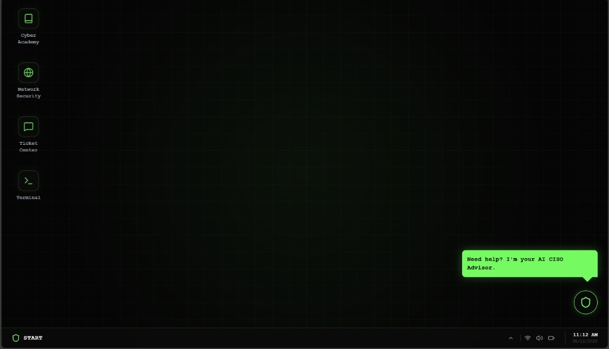
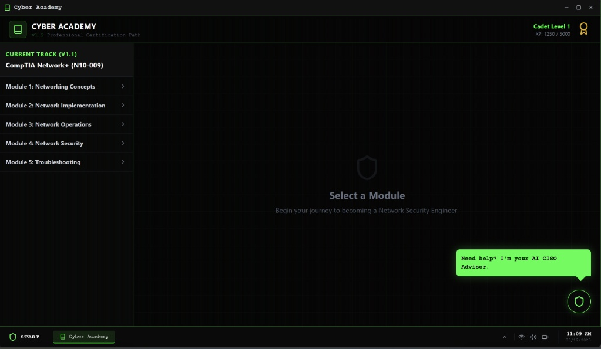
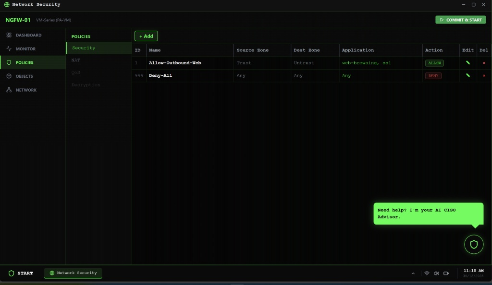
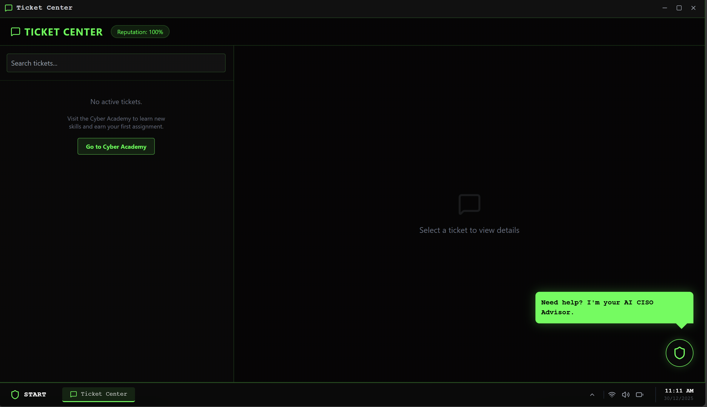

<pre>
   ______      __              ____  _____
  / ____/_  __/ /_  ___  _____/ __ \/ ___/
 / /   / / / / __ \/ _ \/ ___/ / / /\__ \ 
/ /___/ /_/ / /_/ /  __/ /  / /_/ /___/ / 
\____/\__, /_.___/\___/_/   \____//____/  
     /____/                               
</pre>

<h3> >> INITIALIZING CYBER_SECURITY_SIMULATION_PROTOCOL... << </h3>

 

<h2>📟 // SYSTEM_OVERVIEW</h2>

<b>CyberOS</b> is a Next-Gen Educational Environment. It bridges the gap between theory and operations through a browser-based, simulated Operating System.

> `User@CyberOS:~$` *Why watch videos when you can deploy configurations?*

Traditional learning relies on watching videos and answering quizzes. <b>CyberOS</b> changes this paradigm by placing the student in a <b>Simulated Corporate Environment</b>. Users don't just "learn" about firewalls; they configure them. They don't just "read" about tickets; they resolve them under SLA pressure, with automated verification scripts running in the background.

 

<h2>🛠️ // CORE_FEATURES_SHOWCASE</h2>

<h3>01_THE_WORKSPACE [Main_GUI]</h3>

Instead of a static webpage, students interact with a desktop-like interface, managing multiple tools simultaneously. The environment mimics a real Security Analyst's workstation.

  
   
  <i>Figure 1: The CyberOS Dashboard featuring integrated Terminal, Ticket Center, and Security Tools.</i>

  

<table>
  <tr>
    <td width="50%">
      <h3>02_ACADEMY_ARCHIVE</h3>
      
<b>[Learning_Path_Module]</b>

      
The academy component combines video lessons with text-based documentation.

      
Unlike standard platforms, the learning is directly tied to the tools available in the sidebar. As you progress, you unlock new tools in the OS.

    </td>
    <td width="50%">
      
    </td>
  </tr>
</table>

 

<table>
  <tr>
    <td width="50%">
      
    </td>
    <td width="50%">
      <h3>03_NETWORK_DEFENSE</h3>
      
<b>[Target: NGFW-01 (VM-Series)]</b>

      
This is not a multiple-choice simulation. Users interact with a <b>Virtual Firewall Interface</b> to define zones, create security policies, and commit changes.

      <ul>
        <li><b>Traffic Simulation:</b> Users must configure rules to allow/deny specific traffic.</li>
        <li><b>Validation:</b> Incorrect policies cause traffic drops.</li>
      </ul>
    </td>
  </tr>
</table>

 

<h3>04_TICKET_CENTER [Validation_Engine]</h3>

The heart of the simulation. Students receive tickets that mimic real-world requests (e.g., "Internet is down", "Access needed for HR").

<pre>
+ [NEW TICKET] Priority: HIGH
! Subject: "HR Dept cannot access Internet"
# SLA Timer: 15:00 minutes remaining
</pre>

<b>The Logic:</b> When a student marks a ticket as "Resolved", a backend <b>Verification Engine</b> runs specific checks against the virtual infrastructure.
 
<b>Escalation Loop:</b> If the verification fails, the ticket re-opens with an escalation from the "Request Owner".

  
   
  <i>Figure 4: Managing SLAs and responding to user requests in real-time.</i>

  

<h2>🧠 // AI_CISO_ADVISOR</h2>

<b>Model:</b> <code>Context-Aware Neural Net</code> 
Integrated throughout the OS is a context-aware AI Mentor. It acts as a Senior CISO, offering architectural advice rather than just giving away the answers.

 

<h2>🔮 // SYSTEM_ROADMAP</h2>
<table>
  <tr>
    <th>Feature Module</th>
    <th>System Status</th>
    <th>Description</th>
  </tr>
  <tr>
    <td><b>Network Security</b></td>
    <td>✅ <code>[ONLINE]</code></td>
    <td>Firewall Policies, NAT, Zoning</td>
  </tr>
  <tr>
    <td><b>Ticketing System</b></td>
    <td>✅ <code>[ONLINE]</code></td>
    <td>Auto-verification & Escalation logic</td>
  </tr>
  <tr>
    <td><b>SIEM Integration</b></td>
    <td>🚧 <code>[LOADING]</code></td>
    <td>Log ingestion & Alert Triage simulation</td>
  </tr>
  <tr>
    <td><b>Blue Team Labs</b></td>
    <td>📅 <code>[PENDING]</code></td>
    <td>Phishing analysis & Incident Response</td>
  </tr>
</table>

 

<h2>⚠️ // RESTRICTED_ACCESS</h2>
<pre>
#!/bin/warning
echo "The source code, verification scripts, and LLM prompt engineering"
echo "contained within this project are classified intellectual property."
echo "This repository serves as a product portfolio and architectural showcase."
</pre>

 

<b>Tech Stack:</b> React.js (Frontend) • Python (Backend) • LLM Vector Embeddings

© 2025 CyberOS Project. All systems normal.

